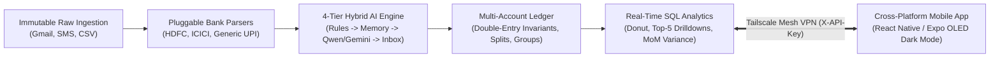

# Expense Tracker v2.0: Master Specification & Planning Portal 💸

> **Source of Truth & Architectural Blueprint Branch (`v2-planning`)**  
> This branch contains the complete product requirements, architectural designs, data models, API contracts, mobile UI/UX specifications, and engineering roadmaps for the **Expense Tracker v2.0** system.

---

## 🏛️ System Overview

The **Expense Tracker v2.0** is a 100% private, self-hosted personal finance ledger and expense intelligence system designed specifically for Indian financial workflows (UPI alerts, multi-bank accounts, credit cards, and cash).

---

## 📚 Complete Documentation Index

| Document | Description | Direct Link |
| :--- | :--- | :--- |
| **Product Requirements Document (PRD)** | Core mission, user personas, problem scenarios, FR-1 to FR-8, NFR-1 to NFR-6, invariants, and success KPIs. | [PRD.md](file:///Users/kaushik/Projects/Expense%20Tracker/docs/PRD.md) |
| **System Architecture & Design** | Decoupled client-server topology, modular seams, sequence diagrams, failure recovery, and Tailscale VPN security. | [ARCHITECTURE.md](file:///Users/kaushik/Projects/Expense%20Tracker/docs/ARCHITECTURE.md) |
| **Data Model & Ledger Invariants** | Complete Entity Relationship Diagram (ERD), full SQL table schemas, double-entry balance formulas, and compound indexes. | [DATA_MODEL.md](file:///Users/kaushik/Projects/Expense%20Tracker/docs/DATA_MODEL.md) |
| **Categorization Engine & Memory** | 4-tier decision cascade, rule patterns, normalized merchant memory, **Selective Learning** toggle, and hybrid LLM failover. | [CATEGORIZATION_ENGINE.md](file:///Users/kaushik/Projects/Expense%20Tracker/docs/CATEGORIZATION_ENGINE.md) |
| **Bank Ingestion & Parser Pipeline** | Immutable staging store, `BankParser` protocol, regex specs for HDFC/ICICI, and SHA-256 deduplication hashing. | [PARSER_PIPELINE.md](file:///Users/kaushik/Projects/Expense%20Tracker/docs/PARSER_PIPELINE.md) |
| **REST API Specification** | OpenAPI 3.1 contracts, endpoint methods, request/response JSON schemas, query filters, and status codes. | [API_SPEC.md](file:///Users/kaushik/Projects/Expense%20Tracker/docs/API_SPEC.md) |
| **Mobile App UI/UX Specification** | OLED Dark Theme design system tokens, screen wireflows (Home, Inbox Triage, Ledger, Analytics, Settings), and offline caching. | [MOBILE_APP_SPEC.md](file:///Users/kaushik/Projects/Expense%20Tracker/docs/MOBILE_APP_SPEC.md) |
| **Testing Strategy & QA Guide** | Invariant test matrix, real bank email fixture suite, LLM fallback testing, and SQL performance benchmarks. | [TESTING_AND_QA.md](file:///Users/kaushik/Projects/Expense%20Tracker/docs/TESTING_AND_QA.md) |
| **Phased Implementation Roadmap** | Phased engineering roadmap (Phase 1 to Phase 7) with granular ticket breakdowns and verification criteria. | [ROADMAP_AND_MILESTONES.md](file:///Users/kaushik/Projects/Expense%20Tracker/docs/ROADMAP_AND_MILESTONES.md) |
| **Ubiquitous Domain Language** | Domain terminology definitions, ubiquitous language, and naming guardrails. | [CONTEXT.md](file:///Users/kaushik/Projects/Expense%20Tracker/CONTEXT.md) |

---

## 📑 Architectural Decision Records (ADRs)

1. [ADR 0001: Multi-Account Ledger & Raw Ingestion Staging](file:///Users/kaushik/Projects/Expense%20Tracker/docs/adr/0001-multi-account-ledger-and-raw-staging.md)
2. [ADR 0002: Mobile App & Headless Backend Architecture](file:///Users/kaushik/Projects/Expense%20Tracker/docs/adr/0002-mobile-app-and-group-analytics-architecture.md)
3. [ADR 0003: Group Lifecycle, Merchant Memory, and Client-Server Topology](file:///Users/kaushik/Projects/Expense%20Tracker/docs/adr/0003-group-lifecycle-and-merchant-memory.md)
4. [ADR 0004: Bank Parser Registry & Authentication Architecture](file:///Users/kaushik/Projects/Expense%20Tracker/docs/adr/0004-parser-registry-and-auth-architecture.md)

---

## 🎯 Key Architectural Invariants

1. **Transfer Zero-Sum Invariant**: Moving funds between accounts alters individual account balances but never inflates monthly burn rate or net worth.
2. **Split Balance Invariant**: Line-item splits must strictly sum to the exact parent transaction amount ($\sum \text{Split.amount} = \text{Transaction.amount}$).
3. **Deterministic AI Precedence**: Deterministic rules and learned merchant memories always override stochastic LLM inferences.
4. **Selective Memory Learning**: A dedicated toggle prevents one-off peer-to-peer transfers (friends/family) from polluting permanent merchant categorization rules.
5. **Zero Cloud Leakage**: Financial transaction logs and raw bank payloads reside solely on the self-hosted host behind Tailscale wireguard encryption.
