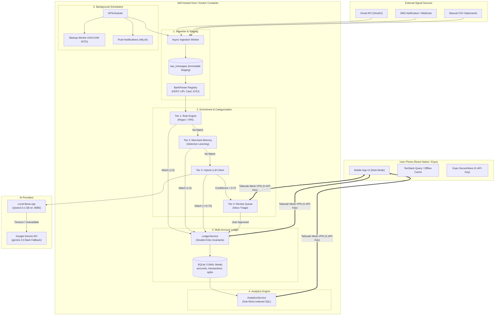
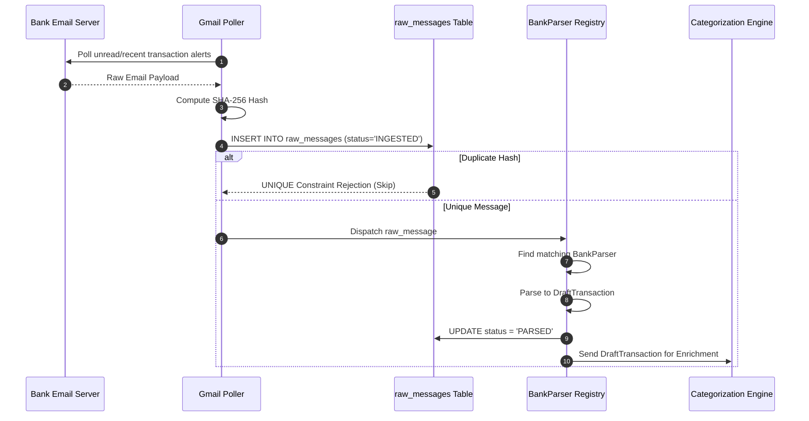
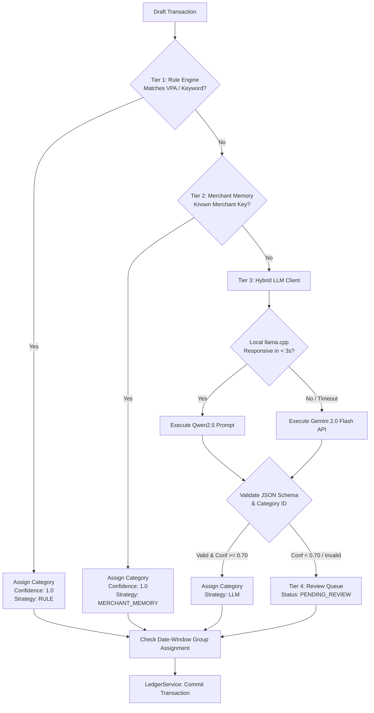
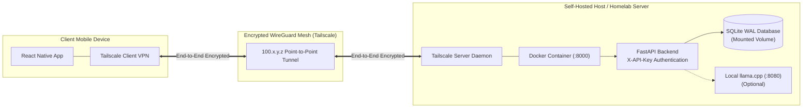

# System Architecture & Technical Design
## Expense Tracker v2.0

---

## 1. System Overview & Topology

The Expense Tracker v2.0 architecture is structured as a **decoupled, local-first client-server model**:
- **Backend Subsystem**: A headless, containerized Python/FastAPI service managing scheduled bank ingestion, deterministic rule matching, hybrid LLM classification, double-entry ledger state, and real-time SQL analytics.
- **Persistence Subsystem**: SQLite 3 with Write-Ahead Logging (`WAL`), ACID transactions, strict foreign keys, and point-in-time snapshotting.
- **Client Subsystem**: A native cross-platform mobile application (React Native / Expo / TypeScript) running on the user's phone, communicating over a private **Tailscale Mesh VPN** with API-Key authentication.

---

## 2. Decoupled Subsystems & Architectural Seams

### 2.1 Ingestion & Staging Seam
- **Responsibility**: Ingest external notification signals asynchronously without coupling external protocol changes to the core ledger.
- **Components**:
  - `GmailPoller`: Queries Gmail API using OAuth credentials with exponential backoff and incremental `historyId` / query timestamps.
  - `RawMessageStore`: Persists raw payloads into `raw_messages`. Deduplication is guaranteed via a SHA-256 hash computed over `(source, external_id, payload_body)`.
  - `BankParserRegistry`: Dynamically evaluates registered `BankParser` implementations. Parsers extract standardized `DraftTransaction` objects (amount, direction, reference number, merchant name, raw timestamp, account identifier).

---

### 2.2 Categorization & Enrichment Seam
- **Responsibility**: Determine the `category_id`, `confidence`, `strategy`, and optional `group_id` for each draft transaction using deterministic precedence.
- **Decision Hierarchy**:
  1. **Tier 1 (Deterministic Rules)**: Evaluates user-defined rules (VPA regex, merchant keyword, transaction amount range). If matched, assign category with `confidence = 1.0` and source `RULE`.
  2. **Tier 2 (Merchant Memory)**: Looks up normalized merchant key in `merchant_memories`. If found, assign category with `confidence = 1.0` and source `MERCHANT_MEMORY`.
  3. **Tier 3 (Hybrid LLM)**:
     - Prompts local `llama.cpp` instance running `Qwen2.5-1.5B-Instruct` on `http://127.0.0.1:8080/v1/chat/completions`.
     - If local instance fails, times out (>3.0s), or is unconfigured, immediately routes request to **Google Gemini API** (`gemini-2.0-flash`).
     - LLM must return structured JSON conforming to the schema `{ "category_id": int, "confidence": float, "reasoning": str }` validated against the existing category dictionary.
  4. **Tier 4 (Review Inbox)**: If confidence $< 0.70$ or LLM parsing fails, transaction is marked with status `PENDING_REVIEW` and routed to the mobile Review Inbox.

---

### 2.3 Ledger & Accounting Seam
- **Responsibility**: Enforce double-entry accounting invariants, calculate running account balances, manage category splits, and update selective merchant memories.
- **Core Operations**:
  - **Expense**: Subtracts `amount` from `account_id.balance`. Contributes to monthly burn.
  - **Income**: Adds `amount` to `account_id.balance`. Contributes to monthly cash inflow.
  - **Transfer**: Atomically subtracts `amount` from `source_account_id.balance` and adds `amount` to `destination_account_id.balance`. Does not count as an expense or income.
  - **Split**: Divides transaction into $N$ line items. Enforces $\sum \text{Split.amount} = \text{Transaction.amount}$.
  - **Selective Learning**: On user approval or category reclassification, checks the `learn_merchant` flag. If `True`, updates `merchant_memories`.

---

### 2.4 Analytics & Aggregation Seam
- **Responsibility**: Compute real-time spending distributions, Month-over-Month variances, top-5 category drilldowns, and pattern anomalies in $< 50\text{ms}$.
- **Design**:
  - Uses direct, compound-indexed SQL queries over `transactions` joined with `categories` and `groups`.
  - Compound Index: `idx_transactions_analytics ON transactions(timestamp, category_id, is_expense, is_transfer, group_id, account_id)`.
  - Zero heavy batch compute; aggregations are calculated on-demand via streaming SQL pipelines.

---

### 2.5 Background Schedulers & Workers
- **APScheduler Engine**: Runs within the FastAPI process lifecycle:
  - **Ingestion Worker**: Polls Gmail every $N$ minutes (configurable, default 15m).
  - **Backup Worker**: Runs daily at 2:00 AM. Executes SQLite `VACUUM INTO '/backups/expense_tracker_YYYYMMDD.db'`.
  - **Notification Worker**: Dispatches push notifications via `ntfy.sh` when pending review items accumulate or anomalous transactions occur.

---

## 3. Network, Security & Deployment Architecture

### 3.1 Security Principles
1. **No Open Public Ports**: The backend container listens strictly on internal Docker networks and Tailscale virtual interfaces. No router port forwarding or public domain DNS required.
2. **Header-Based Authentication**: Every REST API request must include the header `X-API-Key: <configured_secret>`.
3. **Encrypted Mobile Storage**: The mobile client stores the API key and host IP in hardware-backed encrypted storage (`Expo SecureStore` on Android Keystore / iOS Keychain).
4. **Data Isolation**: All bank tokens and OAuth secrets are encrypted at rest using AES-GCM-256 (`cryptography.fernet`).

---

## 4. Failure Recovery & Reliability Modes

| Failure Scenario | Architectural Mitigation |
| :--- | :--- |
| **Bank Email Format Changes** | Raw payload is already preserved in `raw_messages`. Update parser regex in code, then run re-parsing script over stored historical rows without re-fetching from Gmail. |
| **Local LLM Server Down / OOM** | Automatic circuit breaker catches timeout after 3.0s and seamlessly falls back to Google Gemini Flash API. |
| **Internet / Gemini API Outage** | Transactions with missing rules/memories fall back safely to `PENDING_REVIEW` in the local Review Queue with zero data loss. |
| **Host System Crash / Power Cut** | SQLite Write-Ahead Logging (`WAL`) mode guarantees zero database corruption; uncommitted transactions roll back cleanly. |
| **Phone Offline** | Mobile client displays cached financial summaries from local TanStack cache and queues manual cash transactions locally. |
