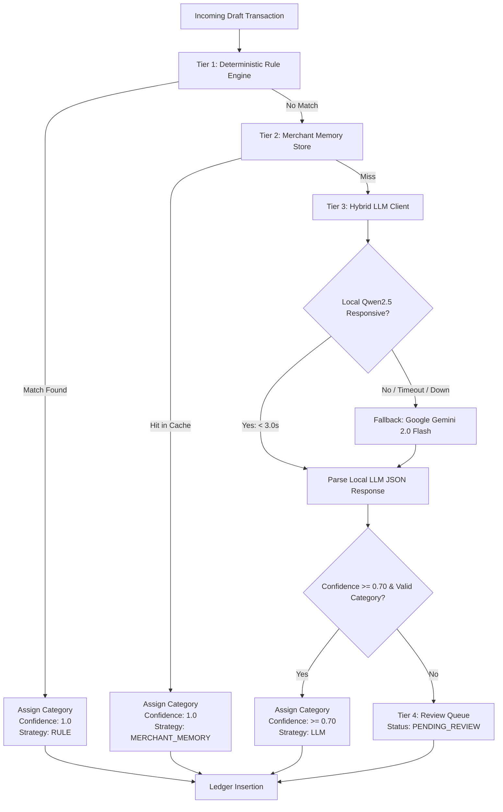

# Multi-Tier Categorization & Merchant Memory Specification
## Expense Tracker v2.0

---

## 1. Categorization Pipeline Overview

The Expense Tracker v2.0 categorization engine is designed for **maximum determinism, minimum latency, zero cloud dependency by default, and self-improving accuracy**.

It executes a strict **4-Tier Priority Cascade**:



---

## 2. Tier 1: Deterministic Rule Engine

### 2.1 Rule Matching Types
Rules are defined by the user and evaluated in ascending order of `priority` (lower integer = higher priority).

1. **`VPA` (UPI Virtual Payment Address Match)**:
   - Evaluates exact or pattern matches against `merchant_vpa` (e.g. `swiggy@icici`, `*@uber`, `paytm-*.@paytm`).
2. **`MERCHANT_EXACT`**:
   - Case-insensitive exact string match on `merchant_name` (e.g. `"Starbucks Coffee"`).
3. **`MERCHANT_CONTAINS`**:
   - Substring match on `merchant_name` (e.g. `"NETFLIX"`, `"AMZN MKTP"`, `"ZOMATO"`).
4. **`REGEX`**:
   - Full Python regex evaluated against `merchant_name`, `merchant_vpa`, and `description` (e.g. `(?i)electricity|bescom|tata power`).

### 2.2 Amount Constrained Rules
Rules can optionally specify `min_amount` and `max_amount`:
- Example: Transactions to `swiggy@icici` with $\text{amount} > 2000$ could assign category **"Food > Team Meals"**, whereas $\le 2000$ assigns **"Food > Food Delivery"**.

---

## 3. Tier 2: Merchant Memory & Selective Learning

### 3.1 What is Merchant Memory?
`MerchantMemory` is an auto-learning lookup table that records past user approvals and category assignments. Once a merchant is classified once, future transactions from that merchant are categorized instantly ($< 1\text{ ms}$) without invoking an LLM.

### 3.2 Key Normalization Algorithm
When a merchant name or VPA is saved to memory, it is normalized to generate a canonical `merchant_key`:
1. If `merchant_vpa` exists:
   - If VPA is a standard commercial merchant (e.g. `swiggy@icici`, `razorpay@axis`), `merchant_key = lowercase(merchant_vpa)`.
2. If only `merchant_name` exists:
   - Strip trailing location identifiers, transaction codes, and digits:
     `"SWIGGY BANGALORE IN 948281"` $\rightarrow$ `swiggy bangalore`.
   - Convert to lowercase and trim extra whitespace.

### 3.3 The Selective Learning Toggle
> [!IMPORTANT]
> **Problem**: In India, peer-to-peer UPI transfers to friends/family (e.g., `rahul@okhdfcbank`) might represent a movie split today, but a rent contribution next month. Auto-learning this mapping would incorrectly lock `rahul@okhdfcbank` to "Entertainment".

**Solution**:
Every time the user approves or changes a category in the mobile app, the UI presents a **"Remember for future transactions"** toggle (defaults to `True` for businesses, `False` for peer VPAs):
- **Toggle ON (`learn_merchant = True`)**: `MerchantMemory` is upserted with `(merchant_key, category_id)` scoped according to Section 3.4.
- **Toggle OFF (`learn_merchant = False`)**: The category is applied strictly to the single transaction being edited, preserving memory cleanliness.

### 3.4 Scoped Rule Generation Strategy
When a transaction is approved with `learn_merchant = True`, the rule engine scopes the memory key dynamically based on the payment method and identifier type:

1. **Commercial UPI VPA (Tier A - Exact VPA)**:
   - For merchant VPAs containing recognized provider domains or business handles (`@icici`, `@axisbank`, `@paytm`, `@hdfcbank`), the rule is scoped to the **exact lowercase VPA** (e.g. `swiggy@icici`).
2. **Card Swipes & POS Terminals (Tier B - Sanitized Substring)**:
   - For credit/debit card transactions lacking VPAs, the raw terminal descriptor is sanitized:
     - Strips terminal serials (`#1042`, `POS-882`), transaction identifiers (`IN`, `TXN-991`), and city names (`BLR`, `MUM`, `DEL`).
     - Example: `"STARBUCKS #0492 BLR IN"` $\rightarrow$ `"starbucks"`.
     - Stored as a `MERCHANT_CONTAINS` rule matching any future card alert containing that canonical brand stem.
3. **Personal Peer VPAs (Tier C - Opt-In Guardrail)**:
   - For peer-to-peer VPAs (`@okhdfcbank`, `@okaxis`, `@ybl` paired with personal names), the UI **defaults the toggle to OFF**.
   - If the user explicitly checks the box (e.g. paying a landlord or maid monthly), the exact VPA is saved.

---

## 4. Tier 3: Hybrid LLM Engine

### 4.1 Architecture & Failover
The system utilizes a **Hybrid Dual-Provider Model**:

| Provider | Model | Hosting | Purpose | Timeout |
| :--- | :--- | :--- | :--- | :--- |
| **Primary** | `Qwen2.5-1.5B-Instruct` | Local `llama.cpp` (`http://localhost:8080`) | 100% Private, offline, zero-latency inference on self-hosted server | 3.0s |
| **Secondary** | `gemini-2.0-flash` | Google AI Studio REST API | High-accuracy cloud fallback when local server is offline or overloaded | 5.0s |

### 4.2 LLM System Prompt & Strict JSON Schema
The LLM is provided with the exact, current list of categories and instructed to return only a JSON object.

#### Prompt Template:
```
You are an expert personal finance categorizer.
Your job is to categorize the following transaction into exactly ONE of the available categories.

TRANSACTION DETAILS:
- Merchant: {merchant_name}
- UPI VPA: {merchant_vpa}
- Amount: INR {amount}
- Raw Description: {description}

AVAILABLE CATEGORIES:
{categories_json_list}

RULES:
1. You MUST pick a category from the AVAILABLE CATEGORIES list by its integer ID.
2. If unsure, pick the most plausible category and set confidence lower (< 0.70).
3. Do NOT invent new category names or IDs.
4. Output STRICT JSON ONLY matching this format:
{
  "category_id": <int>,
  "confidence": <float between 0.0 and 1.0>,
  "reasoning": "<short 1-sentence explanation>"
}
```

#### JSON Output Validation:
- The parser verifies that `category_id` exists in `categories.id`.
- If JSON decoding fails, or `category_id` is invalid, the engine falls back to `Tier 4 (PENDING_REVIEW)` without throwing an unhandled exception.

---

## 5. Tier 4: Human-in-the-Loop Review Queue (Inbox)

When an incoming transaction cannot be classified with high confidence ($\text{confidence} < 0.70$), it is placed in the Review Queue:
- Status is set to `PENDING_REVIEW`.
- An optional push notification is sent via `ntfy.sh` (e.g. *"New ₹450 transaction at unknown merchant 'CHAI POINT' needs review"*).
- The mobile app displays the item on the `InboxScreen` with:
  - Extracted merchant name & amount.
  - LLM's best guess highlighted as a suggestion chip.
  - **One-tap Accept** button.
  - **Quick Category Picker** bottom sheet with fuzzy search.
  - **"Remember merchant"** checkbox.
- Once approved, the transaction transitions to `status = 'POSTED'` and updates the ledger immediately.
