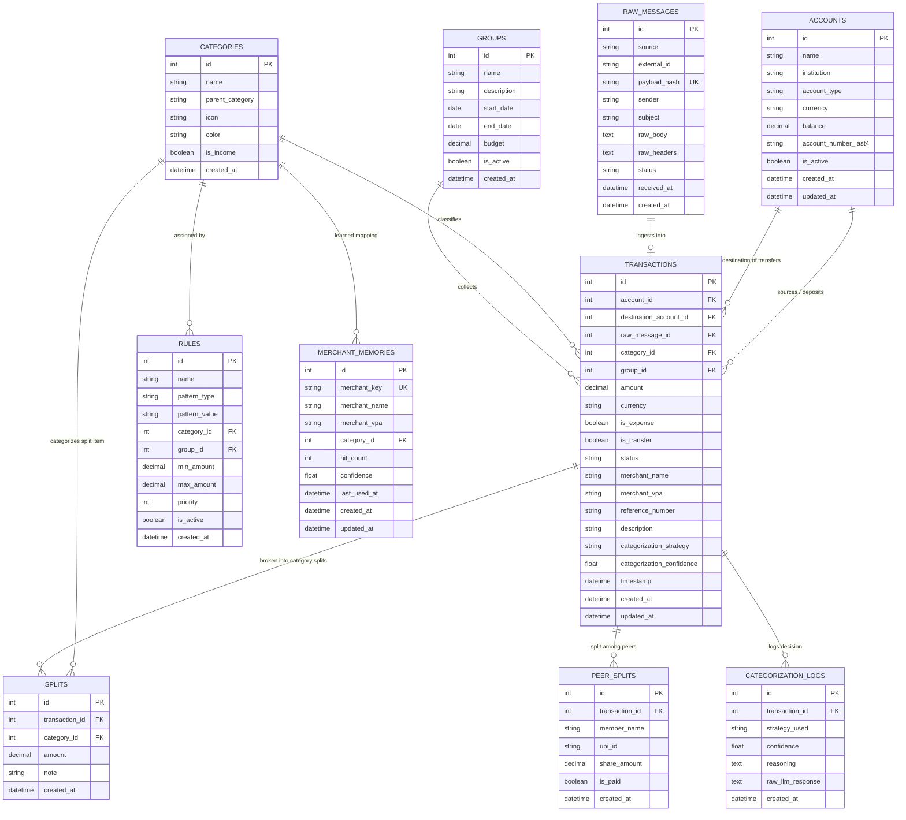

# Data Model, Ledger Invariants & Database Schema
## Expense Tracker v2.0

---

## 1. Entity Relationship Diagram (ERD)



---

## 2. Table Schemas & Specifications

### 2.1 `accounts`
Stores distinct financial buckets holding balances or credit liabilities.

| Column | Type | Nullable | Default | Description |
| :--- | :--- | :--- | :--- | :--- |
| `id` | `INTEGER` | `NO` | `AUTOINCREMENT` | Primary Key |
| `name` | `VARCHAR(100)` | `NO` | - | Human-readable account name (e.g. "HDFC Salary Account") |
| `institution` | `VARCHAR(50)` | `NO` | - | Financial institution (e.g. `HDFC`, `ICICI`, `SBI`, `CASH`, `AMEX`) |
| `account_type` | `VARCHAR(30)` | `NO` | `'SAVINGS'` | `SAVINGS`, `CURRENT`, `CREDIT_CARD`, `WALLET`, `CASH`, `INVESTMENT` |
| `currency` | `VARCHAR(3)` | `NO` | `'INR'` | ISO currency code |
| `balance` | `NUMERIC(14, 2)`| `NO` | `0.00` | Current verified account balance |
| `account_number_last4` | `VARCHAR(4)` | `YES` | `NULL` | Last 4 digits for automatic ingestion mapping |
| `is_active` | `BOOLEAN` | `NO` | `TRUE` | Soft-deletion / active status flag |
| `created_at` | `DATETIME` | `NO` | `CURRENT_TIMESTAMP` | Timestamp created |
| `updated_at` | `DATETIME` | `NO` | `CURRENT_TIMESTAMP` | Timestamp updated |

---

### 2.2 `raw_messages`
Immutable staging store for external banking communications.

| Column | Type | Nullable | Default | Description |
| :--- | :--- | :--- | :--- | :--- |
| `id` | `INTEGER` | `NO` | `AUTOINCREMENT` | Primary Key |
| `source` | `VARCHAR(30)` | `NO` | `'GMAIL'` | Source provider (`GMAIL`, `SMS`, `CSV`, `WEBHOOK`) |
| `external_id` | `VARCHAR(255)` | `NO` | - | External provider message ID (e.g. Gmail Message ID) |
| `payload_hash` | `VARCHAR(64)` | `NO` | - | Cryptographic `SHA-256` hash for deduplication (`UNIQUE`) |
| `sender` | `VARCHAR(255)` | `YES` | `NULL` | Sender address or SMS shortcode |
| `subject` | `VARCHAR(500)` | `YES` | `NULL` | Email subject line |
| `raw_body` | `TEXT` | `NO` | - | Full verbatim raw text/HTML body |
| `raw_headers` | `TEXT` | `YES` | `NULL` | JSON-encoded MIME headers |
| `status` | `VARCHAR(30)` | `NO` | `'INGESTED'` | Lifecycle: `INGESTED`, `PARSED`, `FAILED_TO_PARSE`, `RE_PARSED` |
| `received_at` | `DATETIME` | `NO` | - | Timestamp message was received by provider |
| `created_at` | `DATETIME` | `NO` | `CURRENT_TIMESTAMP` | Timestamp stored locally |

---

### 2.3 `categories`
Hierarchical taxonomy for organizing spending and income.

| Column | Type | Nullable | Default | Description |
| :--- | :--- | :--- | :--- | :--- |
| `id` | `INTEGER` | `NO` | `AUTOINCREMENT` | Primary Key |
| `name` | `VARCHAR(100)` | `NO` | - | Category name (e.g. "Dining Out", "Groceries", "Salary") |
| `parent_category`| `VARCHAR(100)` | `YES` | `NULL` | Parent group (e.g. "Food & Dining", "Housing", "Income") |
| `icon` | `VARCHAR(50)` | `NO` | `'tag'` | Lucide / Material icon name |
| `color` | `VARCHAR(10)` | `NO` | `'#8B5CF6'` | Hex color string for UI chips and charts |
| `is_income` | `BOOLEAN` | `NO` | `FALSE` | Flag indicating income category |
| `created_at` | `DATETIME` | `NO` | `CURRENT_TIMESTAMP` | Timestamp created |

---

### 2.4 `groups`
Contextual event and trip collections driven by date windows or manual assignment.

| Column | Type | Nullable | Default | Description |
| :--- | :--- | :--- | :--- | :--- |
| `id` | `INTEGER` | `NO` | `AUTOINCREMENT` | Primary Key |
| `name` | `VARCHAR(100)` | `NO` | - | Group name (e.g. "Goa Trip 2026", "Apartment Setup") |
| `description` | `TEXT` | `YES` | `NULL` | Contextual notes |
| `start_date` | `DATE` | `YES` | `NULL` | Auto-assignment start window |
| `end_date` | `DATE` | `YES` | `NULL` | Auto-assignment end window |
| `budget` | `NUMERIC(14, 2)`| `YES` | `NULL` | Optional spending target |
| `is_active` | `BOOLEAN` | `NO` | `TRUE` | Active tracking state |
| `created_at` | `DATETIME` | `NO` | `CURRENT_TIMESTAMP` | Timestamp created |

---

### 2.5 `transactions`
The core ledger table recording all financial movements.

| Column | Type | Nullable | Default | Description |
| :--- | :--- | :--- | :--- | :--- |
| `id` | `INTEGER` | `NO` | `AUTOINCREMENT` | Primary Key |
| `account_id` | `INTEGER` | `NO` | - | FK $\rightarrow$ `accounts.id` (`ON DELETE RESTRICT`) |
| `destination_account_id` | `INTEGER` | `YES` | `NULL` | FK $\rightarrow$ `accounts.id` (`ON DELETE RESTRICT`) for transfers |
| `raw_message_id` | `INTEGER` | `YES` | `NULL` | FK $\rightarrow$ `raw_messages.id` (`ON DELETE SET NULL`) |
| `category_id` | `INTEGER` | `YES` | `NULL` | FK $\rightarrow$ `categories.id` (`ON DELETE RESTRICT`) |
| `group_id` | `INTEGER` | `YES` | `NULL` | FK $\rightarrow$ `groups.id` (`ON DELETE SET NULL`) |
| `amount` | `NUMERIC(14, 2)`| `NO` | - | Transaction amount (always positive decimal) |
| `currency` | `VARCHAR(3)` | `NO` | `'INR'` | Currency code |
| `is_expense` | `BOOLEAN` | `NO` | `TRUE` | `TRUE` = Outflow, `FALSE` = Inflow / Transfer |
| `is_transfer` | `BOOLEAN` | `NO` | `FALSE` | `TRUE` = Intra-account transfer |
| `status` | `VARCHAR(30)` | `NO` | `'POSTED'` | `POSTED`, `PENDING_REVIEW`, `DRAFT`, `RECONCILED` |
| `merchant_name` | `VARCHAR(255)` | `NO` | - | Normalized payee/merchant name |
| `merchant_vpa` | `VARCHAR(255)` | `YES` | `NULL` | UPI Virtual Payment Address (e.g. `swiggy@icici`) |
| `reference_number`| `VARCHAR(100)` | `YES` | `NULL` | Bank UTR / Reference ID / Cheque number |
| `description` | `TEXT` | `YES` | `NULL` | User notes or extracted memo |
| `categorization_strategy` | `VARCHAR(30)` | `NO` | `'MANUAL'` | `RULE`, `MERCHANT_MEMORY`, `LLM`, `MANUAL` |
| `categorization_confidence`| `FLOAT` | `NO` | `1.0` | Classification confidence ($0.0 \dots 1.0$) |
| `timestamp` | `DATETIME` | `NO` | - | Actual financial event timestamp |
| `created_at` | `DATETIME` | `NO` | `CURRENT_TIMESTAMP` | Record creation timestamp |
| `updated_at` | `DATETIME` | `NO` | `CURRENT_TIMESTAMP` | Record update timestamp |

---

### 2.6 `splits`
Line-item category breakdowns for single transactions.

| Column | Type | Nullable | Default | Description |
| :--- | :--- | :--- | :--- | :--- |
| `id` | `INTEGER` | `NO` | `AUTOINCREMENT` | Primary Key |
| `transaction_id` | `INTEGER` | `NO` | - | FK $\rightarrow$ `transactions.id` (`ON DELETE CASCADE`) |
| `category_id` | `INTEGER` | `NO` | - | FK $\rightarrow$ `categories.id` (`ON DELETE RESTRICT`) |
| `amount` | `NUMERIC(14, 2)`| `NO` | - | Split line amount |
| `note` | `VARCHAR(255)` | `YES` | `NULL` | Line item memo |
| `created_at` | `DATETIME` | `NO` | `CURRENT_TIMESTAMP` | Timestamp created |

---

### 2.6.2 `peer_splits`
Allocation of transaction liability among peers (Split Members) for social bill splitting and debt tracking.

| Column | Type | Nullable | Default | Description |
| :--- | :--- | :--- | :--- | :--- |
| `id` | `INTEGER` | `NO` | `AUTOINCREMENT` | Primary Key |
| `transaction_id` | `INTEGER` | `NO` | - | FK $\rightarrow$ `transactions.id` (`ON DELETE CASCADE`) |
| `member_name` | `VARCHAR(100)` | `NO` | - | Counterparty name (e.g. "Rahul", "Priya") |
| `upi_id` | `VARCHAR(255)` | `YES` | `NULL` | Peer's UPI VPA (e.g. `rahul@oksbi`) |
| `share_amount` | `NUMERIC(14, 2)`| `NO` | - | Counterparty's owed share amount |
| `is_paid` | `BOOLEAN` | `NO` | `FALSE` | Reimbursement status |
| `settled_at` | `DATETIME` | `YES` | `NULL` | Timestamp when peer settled their share |
| `created_at` | `DATETIME` | `NO` | `CURRENT_TIMESTAMP` | Timestamp created |

---

### 2.7 `rules`
Deterministic pattern matching rules for automated categorization.

| Column | Type | Nullable | Default | Description |
| :--- | :--- | :--- | :--- | :--- |
| `id` | `INTEGER` | `NO` | `AUTOINCREMENT` | Primary Key |
| `name` | `VARCHAR(100)` | `NO` | - | Rule title |
| `pattern_type` | `VARCHAR(30)` | `NO` | `'VPA'` | `VPA`, `MERCHANT_EXACT`, `MERCHANT_CONTAINS`, `REGEX` |
| `pattern_value` | `VARCHAR(255)` | `NO` | - | Match value / pattern string |
| `category_id` | `INTEGER` | `NO` | - | FK $\rightarrow$ `categories.id` (`ON DELETE RESTRICT`) |
| `group_id` | `INTEGER` | `YES` | `NULL` | Optional FK $\rightarrow$ `groups.id` (`ON DELETE SET NULL`) |
| `min_amount` | `NUMERIC(14, 2)`| `YES` | `NULL` | Optional lower bound threshold |
| `max_amount` | `NUMERIC(14, 2)`| `YES` | `NULL` | Optional upper bound threshold |
| `priority` | `INTEGER` | `NO` | `100` | Evaluation priority (lower = higher precedence) |
| `is_active` | `BOOLEAN` | `NO` | `TRUE` | Rule active toggle |
| `created_at` | `DATETIME` | `NO` | `CURRENT_TIMESTAMP` | Timestamp created |

---

### 2.8 `merchant_memories`
Auto-learned persistent cache mapping normalized merchant identities and VPAs to approved categories.

| Column | Type | Nullable | Default | Description |
| :--- | :--- | :--- | :--- | :--- |
| `id` | `INTEGER` | `NO` | `AUTOINCREMENT` | Primary Key |
| `merchant_key` | `VARCHAR(255)` | `NO` | - | Normalized merchant key or exact VPA (`UNIQUE`) |
| `merchant_name` | `VARCHAR(255)` | `NO` | - | Display merchant title |
| `merchant_vpa` | `VARCHAR(255)` | `YES` | `NULL` | Associated UPI VPA |
| `category_id` | `INTEGER` | `NO` | - | FK $\rightarrow$ `categories.id` (`ON DELETE RESTRICT`) |
| `hit_count` | `INTEGER` | `NO` | `1` | Total lifetime matches |
| `confidence` | `FLOAT` | `NO` | `1.0` | Learned confidence score |
| `last_used_at` | `DATETIME` | `NO` | `CURRENT_TIMESTAMP` | Last time rule matched an ingestion |
| `created_at` | `DATETIME` | `NO` | `CURRENT_TIMESTAMP` | Timestamp learned |
| `updated_at` | `DATETIME` | `NO` | `CURRENT_TIMESTAMP` | Timestamp updated |

---

### 2.9 `categorization_logs`
Audit log of every automated classification decision.

| Column | Type | Nullable | Default | Description |
| :--- | :--- | :--- | :--- | :--- |
| `id` | `INTEGER` | `NO` | `AUTOINCREMENT` | Primary Key |
| `transaction_id` | `INTEGER` | `NO` | - | FK $\rightarrow$ `transactions.id` (`ON DELETE CASCADE`) |
| `strategy_used` | `VARCHAR(30)` | `NO` | - | `RULE`, `MERCHANT_MEMORY`, `LOCAL_LLM`, `GEMINI_LLM`, `MANUAL` |
| `confidence` | `FLOAT` | `NO` | - | Confidence assigned |
| `reasoning` | `TEXT` | `YES` | `NULL` | Natural language explanation from LLM/rule |
| `raw_llm_response`| `TEXT` | `YES` | `NULL` | Verbatim JSON response from LLM provider |
| `created_at` | `DATETIME` | `NO` | `CURRENT_TIMESTAMP` | Timestamp logged |

---

## 3. Database Indexes & Performance Optimization

To ensure sub-50ms query response times even with 100,000+ transactions on constrained hardware (e.g. Raspberry Pi 4), the following compound indexes are required:

```sql
-- 1. Analytics and Time-Series Aggregations
CREATE INDEX idx_transactions_analytics 
ON transactions(timestamp, category_id, is_expense, is_transfer, group_id, account_id);

-- 2. Inbox Review Queue Filtering
CREATE INDEX idx_transactions_inbox 
ON transactions(status, timestamp DESC) 
WHERE status = 'PENDING_REVIEW';

-- 3. Group Spending Aggregation
CREATE INDEX idx_transactions_group 
ON transactions(group_id, timestamp) 
WHERE group_id IS NOT NULL;

-- 4. Cryptographic Message Deduplication
CREATE UNIQUE INDEX idx_raw_messages_hash 
ON raw_messages(payload_hash);

-- 5. Merchant Memory Normalized Lookup
CREATE UNIQUE INDEX idx_merchant_memories_key 
ON merchant_memories(merchant_key);

-- 6. Split Sum Validation
CREATE INDEX idx_splits_tx 
ON splits(transaction_id);

-- 7. Cross-Channel UTR / Reference Deduplication
CREATE INDEX idx_transactions_utr 
ON transactions(reference_number) 
WHERE reference_number IS NOT NULL;

-- 8. Peer Split Lookup & Debt Status
CREATE INDEX idx_peer_splits_tx 
ON peer_splits(transaction_id, is_paid);
```

---

## 4. Ledger Invariants & Mathematical Equations

### 4.1 Balance Invariant
For any given account $A$, the balance is defined deterministically:
$$\text{Balance}(A) = \text{InitialBalance}(A) + \sum \text{Inflows}(A) - \sum \text{Outflows}(A)$$
Where:
- $\text{Inflow} \iff (\text{account\_id} = A \land \text{is\_expense} = \text{FALSE} \land \text{is\_transfer} = \text{FALSE}) \lor (\text{destination\_account\_id} = A \land \text{is\_transfer} = \text{TRUE})$
- $\text{Outflow} \iff (\text{account\_id} = A \land \text{is\_expense} = \text{TRUE}) \lor (\text{account\_id} = A \land \text{is\_transfer} = \text{TRUE})$

### 4.2 Split Invariants
- **Category Split Sum Invariant**:
  $$\forall T \in \text{Transactions with Category Splits}: \quad \text{amount}(T) = \sum_{s \in \text{Splits}(T)} \text{amount}(s)$$
- **Peer Split Sum Invariant**:
  $$\forall T \in \text{Transactions with Peer Splits}: \quad \sum_{m \in \text{PeerSplits}(T)} \text{share\_amount}(m) \le \text{amount}(T)$$
  The difference $\text{amount}(T) - \sum \text{share\_amount}$ represents the user's personal share.

### 4.3 Cash Flow Equations
- **Monthly Income**: $\sum \text{amount}(T)$ where $\text{month}(T) = M \land \text{is\_expense} = \text{FALSE} \land \text{is\_transfer} = \text{FALSE} \land \text{status} = \text{'POSTED'}$
- **Monthly Gross Outflow**: $\sum \text{amount}(T)$ where $\text{month}(T) = M \land \text{is\_expense} = \text{TRUE} \land \text{is\_transfer} = \text{FALSE} \land \text{status} = \text{'POSTED'}$
- **Personal Monthly Burn Rate (Adjusted for Peer Splits)**:
  $$\text{Monthly Burn} = \text{Monthly Gross Outflow} - \sum_{m \in \text{PeerSplits}(T), \text{month}(T)=M} \text{share\_amount}(m)$$
- **Outstanding Peer Receivables (Owed to User)**:
  $$\text{Total Receivables} = \sum_{m \in \text{PeerSplits}, \text{is\_paid} = \text{FALSE}} \text{share\_amount}(m)$$
- **Net Savings**: $\text{Monthly Income} - \text{Personal Monthly Burn}$
- **Savings Rate**: $\frac{\text{Net Savings}}{\text{Monthly Income}} \times 100\%$ (when $\text{Monthly Income} > 0$)
