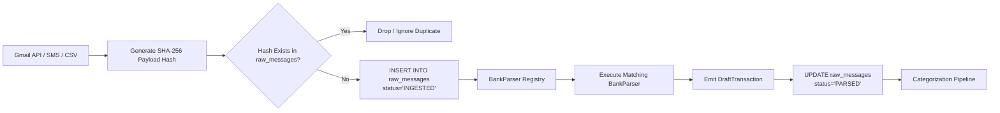

# Bank Ingestion & Pluggable Parser Pipeline
## Expense Tracker v2.0

---

## 1. Architectural Philosophy: Immutable Staging First

Traditional financial trackers immediately parse incoming emails and discard the raw payload. When a bank updates its email template (e.g. adding a new line format or changing date representations), old emails cannot be re-parsed, resulting in lost data or manual data entry.

**The v2.0 Staging Store Principle**:
1. **Verbatim Persistence**: Every raw email, SMS payload, or CSV row is stored in `raw_messages` before any parsing occurs.
2. **Cryptographic Deduplication**: Messages are deduplicated using a SHA-256 hash before parsing.
3. **Pluggable & Pure Parsers**: Parsers are stateless pure functions that inspect `raw_message` and return `list[DraftTransaction]`.
4. **Historical Re-playability**: If a parser bug is fixed or a new bank format added, the system can re-parse stored historical raw messages without touching Gmail APIs.



---

## 2. The `BankParser` Protocol Specification

All bank parsers must implement the following Python protocol:

```python
from typing import Protocol, runtime_checkable
from dataclasses import dataclass
from datetime import datetime
from decimal import Decimal
from typing import Optional

@dataclass
class DraftTransaction:
    raw_message_id: int
    account_institution: str          # e.g. "HDFC", "ICICI", "SBI"
    account_number_last4: Optional[str] # e.g. "9482"
    amount: Decimal                   # Always positive Decimal
    currency: str                     # e.g. "INR"
    is_expense: bool                  # True for debits, False for credits
    is_transfer: bool                 # True for detected intra-account transfers
    merchant_name: str                # Normalized payee/merchant
    merchant_vpa: Optional[str]       # UPI VPA if present (e.g. swiggy@icici)
    reference_number: Optional[str]   # UTR / Bank Reference No
    raw_timestamp: datetime           # Extracted timestamp from alert
    closing_balance: Optional[Decimal] # Extracted balance if available
    description: Optional[str]        # Notes/memo

@runtime_checkable
class BankParser(Protocol):
    name: str
    institution: str

    def can_handle(self, raw_message: "RawMessage") -> bool:
        """Inspects sender, subject, or body patterns to determine compatibility."""
        ...

    def parse(self, raw_message: "RawMessage") -> list[DraftTransaction]:
        """Extracts structured DraftTransaction objects from raw_message."""
        ...
```

---

## 3. Supported Bank Parsers & Regex Specifications

### 3.1 HDFC Bank UPI Email Parser (`HdfcUpiParser`)
- **Sender Check**: `sender.endswith("alerts@hdfcbank.net")` or `sender.endswith("hdfcbank.bank.in")`
- **Subject Check**: `subject` contains `"UPI"` or `"debited via UPI"` or `"credited via UPI"`
- **Debit Pattern**:
  ```regex
  (?i)Rs\.?\s*([0-9,]+(?:\.[0-9]{2})?)\s*(?:has been debited from account|debited from your account \*\*([0-9]{4}))\s*(?:to\s+([^\.]+?)(?:\s+on|\.))?(?:.*?(?:VPA\s+([a-zA-Z0-9.\-_]+@[a-zA-Z0-9]+)))?(?:.*?(?:UPI Ref(?:\s*No\.?)?\s*([0-9]+)))?
  ```
- **Credit Pattern**:
  ```regex
  (?i)Rs\.?\s*([0-9,]+(?:\.[0-9]{2})?)\s*(?:has been credited to your account|credited to your account \*\*([0-9]{4}))\s*(?:from\s+([^\.]+?)(?:\s+on|\.))?
  ```
- **Closing Balance Pattern**:
  ```regex
  (?i)Avail(?:able)?\s+bal(?:ance)?:?\s*Rs\.?\s*([0-9,]+(?:\.[0-9]{2})?)
  ```

---

### 3.2 HDFC Bank Credit & Debit Card Parser (`HdfcCardParser`)
- **Sender Check**: `alerts@hdfcbank.net`
- **Subject Check**: `subject` contains `"Transaction alert for your HDFC Bank Card"`
- **Regex Extraction**:
  ```regex
  (?i)Rs\.?\s*([0-9,]+(?:\.[0-9]{2})?)\s*was spent on your HDFC Bank (Credit|Debit) Card ending \*\*([0-9]{4})\s+at\s+([^\.]+?)\s+on\s+([0-9\-\/ :]+)
  ```

---

### 3.3 ICICI Bank Alerts Parser (`IciciAlertParser`)
- **Sender Check**: `alerts@icicibank.com` or `customercare@icicibank.com`
- **Regex Extraction**:
  ```regex
  (?i)Account\s+\*\*([0-9]{4})\s+is\s+(debited|credited)\s+with\s+INR\s+([0-9,]+(?:\.[0-9]{2})?)\s+on\s+([0-9a-zA-Z\-\/ :]+)\s+towards\s+([^\.]+?)\.\s*(?:UPI Ref(?:\s*No\.?)?\s*([0-9]+))?
  ```

---

### 3.4 Generic UPI Parser (`GenericUpiParser`)
- Serves as a fallback for standard Indian banking SMS/email notifications across SBI, Axis, Kotak, and Paytm Bank:
  ```regex
  (?i)(?:Rs\.?|INR)\s*([0-9,]+(?:\.[0-9]{2})?)\s*(debited|credited)\s*(?:from|to)?\s*(?:A\/c|Acct|Account)?\s*(?:\*+|x+)?([0-9]{3,4})?\s*(?:to|from|towards|at)\s*([a-zA-Z0-9\s._\-@]+?)(?:\s+on|\s+ref|\.|\n)
  ```

---

## 4. Message Deduplication & Hash Computation

To ensure zero duplicate transactions across polling runs, the system calculates a deterministic SHA-256 hash:

$$\text{payload\_hash} = \text{SHA256}(\text{source} \parallel \text{external\_id} \parallel \text{sender} \parallel \text{received\_at\_iso} \parallel \text{trimmed\_body\_preview})$$

If the database detects a collision (`UNIQUE constraint on raw_messages.payload_hash`), the ingestion worker quietly skips the message with an `INFO` log.

### 4.2 Cross-Channel UTR Deduplication & Enrichment Merge
When an on-demand SMS is pasted by the user, and a corresponding bank email arrives later via background Gmail polling:
1. **UTR Match Discovery**: The engine queries `transactions` for an existing record with matching `reference_number` (Bank UTR) within a 48-hour window.
2. **Merge Execution**:
   - The email is saved in `raw_messages` with status `'MERGED'`.
   - The existing `transactions` row is updated with missing high-fidelity data (e.g. verified `account_id` from email's `last4`, closing balance snapshot, full corporate branch descriptor).
   - The transaction's user-approved `category_id`, `splits`, `peer_splits`, and notes are left intact.
   - Zero duplicate transactions are created in the ledger.

---

## 5. Historical Re-Parsing Workflow

When a new bank parser is added or regex improved:
1. The administrator invokes `POST /api/v1/system/reparse-history?source=GMAIL&from_date=2026-01-01`.
2. The background worker loads rows from `raw_messages` matching the criteria.
3. The parser executes against each raw payload and produces refreshed `DraftTransaction` objects.
4. Existing transactions linked via `raw_message_id` have their extracted attributes updated in-place without altering manually adjusted categories or group assignments.
