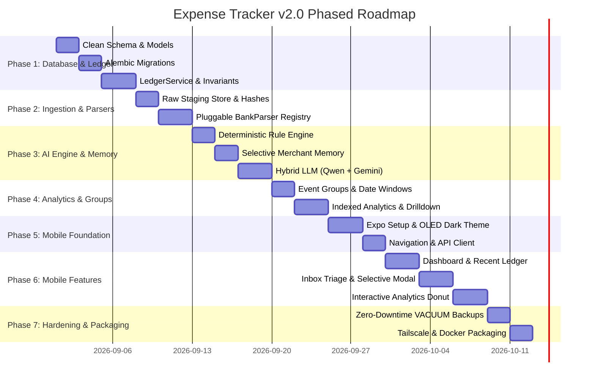

# Phased Implementation Roadmap & Milestones
## Expense Tracker v2.0

---

## 1. Engineering Roadmap Overview

To ensure strict adherence to incremental software development and prevent regressions, implementation is structured across **7 atomic phases**:

---

## 2. Phased Milestone Breakdown

### Phase 1: Database Schema & Multi-Account Ledger Core
- **Ticket 1.1: SQLAlchemy 2.0 Async Domain Models**
  - Implement models: `Account`, `Transaction`, `Split`, `Category`, `Group`, `Rule`, `MerchantMemory`, `RawMessage`, `CategorizationLog`.
  - Enforce foreign keys, cascade rules, and compound analytics indexes.
- **Ticket 1.2: Clean Alembic Migration Engine**
  - Create baseline migration script with SQLite foreign key pragmas and WAL journal mode.
- **Ticket 1.3: LedgerService & Invariant Validator**
  - Implement double-entry balance updates for `Expense`, `Income`, and `Transfer`.
  - Validate line-item splits ($\sum \text{Splits} = \text{Amount}$).
  - Comprehensive unit test suite for ledger invariants.

---

### Phase 2: Ingestion Staging & Pluggable Bank Parsers
- **Ticket 2.1: Immutable Staging Store**
  - Implement `raw_messages` persistence with SHA-256 deduplication hashing.
- **Ticket 2.2: BankParser Protocol & Registry**
  - Implement `BankParser` protocol and registry dispatcher.
  - Author `HdfcUpiParser` (email alert regex extraction).
  - Author `HdfcCardParser` (credit/debit card notification alerts).
  - Author `IciciAlertParser` and `GenericUpiParser`.
- **Ticket 2.3: Parser Fixture Regression Tests**
  - Build test suite against anonymized real email payloads.

---

### Phase 3: Multi-Tier Categorization & Hybrid AI Engine
- **Ticket 3.1: Tier 1 Deterministic Rule Engine**
  - Implement pattern matching for VPA regex, merchant substring, and amount limits.
- **Ticket 3.2: Tier 2 Merchant Memory with Selective Learning**
  - Implement normalized merchant key generation.
  - Implement conditional memory upsert based on `learn_merchant` flag.
- **Ticket 3.3: Tier 3 Hybrid LLM Client**
  - Implement primary local `llama.cpp` client (`Qwen2.5-1.5B`) with 3.0s timeout circuit breaker.
  - Implement secondary fallback to **Google Gemini 2.0 Flash** via Google AI Studio API.
  - Enforce structured JSON schema validation against database category IDs.
- **Ticket 3.4: Tier 4 Review Queue Routing**
  - Implement automatic routing of low-confidence ($< 0.70$) transactions to `PENDING_REVIEW`.

---

### Phase 4: Event Groups & Real-Time Analytics Engine
- **Ticket 4.1: Contextual Event Groups**
  - Implement date-window auto-assignment (`[start_date, end_date]`).
  - Implement manual group override and un-grouping capabilities.
- **Ticket 4.2: Real-Time Analytics Endpoints**
  - `GET /api/v1/analytics/summary` (Income, Burn rate, Savings rate).
  - `GET /api/v1/analytics/category-breakdown` (Category distributions).
  - `GET /api/v1/analytics/category/{id}/drilldown` (Top 5 largest spends).
  - `GET /api/v1/analytics/mom-comparison` (Month-over-Month variance).

---

### Phase 5: React Native Expo Mobile App Foundation
- **Ticket 5.1: Mobile Project Initialization & Design System**
  - Set up React Native Expo with TypeScript.
  - Configure OLED Dark Theme tokens (`#090A0F` background, `#131620` surfaces, `#8B5CF6` accent).
- **Ticket 5.2: Secure Storage & API Client**
  - Implement `api.ts` client with `X-API-Key` headers.
  - Store credentials in `Expo SecureStore`.
  - Configure TanStack Query with `AsyncStorage` caching.
- **Ticket 5.3: Tab Navigation Architecture**
  - Set up 5-tab bottom navigation bar (`Home`, `Inbox`, `Add`, `Analytics`, `Settings`).

---

### Phase 6: Mobile Feature Suite & Interactive Charts
- **Ticket 6.1: Home Dashboard Screen**
  - Net Worth hero card, Monthly Burn progress, Account balance carousel, Recent transactions feed.
- **Ticket 6.2: Review Inbox Triage Screen**
  - Swipeable review cards, suggested category pills, **Selective Learning Checkbox**, one-tap approve.
- **Ticket 6.3: Full Ledger & Transaction Detail Screen**
  - Paginated transaction list, multi-filter drawer, search bar, split editor.
- **Ticket 6.4: Interactive Analytics & Donut Drilldown**
  - Animated donut chart (`react-native-gifted-charts`).
  - Tapping slice opens bottom sheet displaying **Top 5 Largest Spends**.
  - Month-over-Month variance list with delta indicators.
- **Ticket 6.5: Settings & Tools Screen**
  - Tailscale backend IP configuration, Sync Now trigger, Rule editor.

---

### Phase 7: Hardening, Background Schedulers & Deployment
- **Ticket 7.1: Zero-Downtime Backups**
  - Scheduled daily 2:00 AM `VACUUM INTO` backup worker.
- **Ticket 7.2: Unified Push Notifications**
  - `ntfy.sh` integration for inbox alerts and spending anomaly warnings.
- **Ticket 7.3: Docker & Tailscale Packaging**
  - Create production multi-stage `Dockerfile` and `docker-compose.yml`.
  - Document zero-port-forwarding Tailscale setup.
