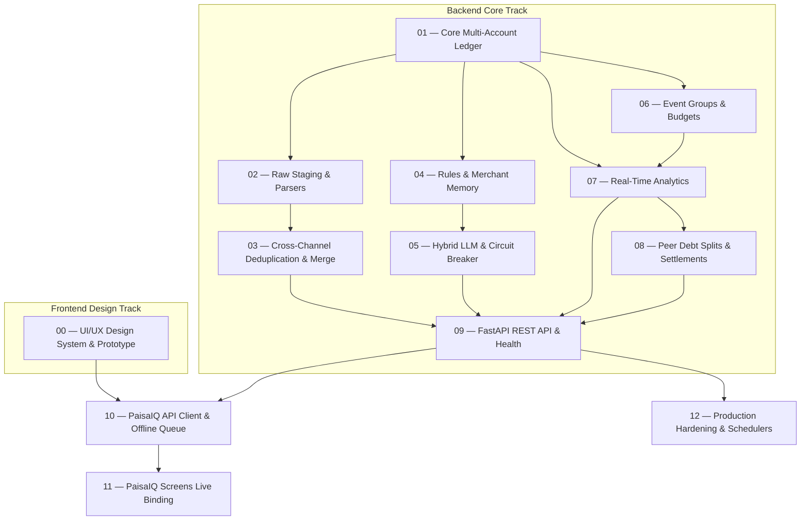

# Execution Tickets: Expense Tracker v2.0

This directory contains the authoritative, atomic tracer-bullet vertical slice tickets for the implementation of Expense Tracker v2.0, adhering to the validated specifications in [`plans/PLAN_VALIDATION.md`](file:///Users/kaushik/Projects/Expense%20Tracker/plans/PLAN_VALIDATION.md) and [`docs/specs/0001-expense-tracker-v2-spec.md`](file:///Users/kaushik/Projects/Expense%20Tracker/docs/specs/0001-expense-tracker-v2-spec.md).

---

## Dependency Graph & Execution Order

---

## Ticket Catalog

| # | Ticket Title | Blocked By | Primary Scope |
| :-: | :--- | :--- | :--- |
| **00** | [PaisaIQ UI/UX Design & Prototype](file:///Users/kaushik/Projects/Expense%20Tracker/docs/tickets/00-paisaiq-ui-ux-design-prototype.md) | None (Ready) | Standalone prototype dev server, design token refinement, screen review |
| **01** | [Core Multi-Account Ledger](file:///Users/kaushik/Projects/Expense%20Tracker/docs/tickets/01-core-multi-account-ledger.md) | None (Ready) | Models, SQLite WAL, Double-Entry Invariants, Category Splits |
| **02** | [Raw Staging & Multi-Bank Parsers](file:///Users/kaushik/Projects/Expense%20Tracker/docs/tickets/02-pluggable-raw-staging-and-parsers.md) | 01 | SHA-256 Staging Store, BankParser Protocol, HDFC/ICICI Parsers |
| **03** | [Cross-Channel Deduplication & Merge](file:///Users/kaushik/Projects/Expense%20Tracker/docs/tickets/03-cross-channel-utr-deduplication.md) | 02 | 7-day UTR sliding window, non-destructive enrichment merge |
| **04** | [Deterministic Rules & Merchant Memory](file:///Users/kaushik/Projects/Expense%20Tracker/docs/tickets/04-deterministic-rules-and-merchant-memory.md) | 01 | Tier 1 regex rules, Tier 2 scoped merchant memory with auto-learn |
| **05** | [Hybrid LLM & Circuit Breaker](file:///Users/kaushik/Projects/Expense%20Tracker/docs/tickets/05-hybrid-llm-categorization-and-circuit-breaker.md) | 04 | Local Qwen2.5 GGUF, Gemini 2.0 Flash fallback, review isolation |
| **06** | [Event Groups & Trip Budgets](file:///Users/kaushik/Projects/Expense%20Tracker/docs/tickets/06-event-groups-and-trip-budgets.md) | 01 | Date-window auto-assignment, manual overrides, isolated budgets |
| **07** | [Real-Time Analytics & Drilldowns](file:///Users/kaushik/Projects/Expense%20Tracker/docs/tickets/07-real-time-analytics-and-drilldowns.md) | 01, 06 | Sub-50ms indexed SQL aggregations, top-5 drilldowns, MoM variance |
| **08** | [Peer Debt Splits & Settlements](file:///Users/kaushik/Projects/Expense%20Tracker/docs/tickets/08-peer-debt-splits-and-settlements.md) | 01, 07 | Multi-member debt shares, repayment linking, zero income inflation |
| **09** | [FastAPI REST Endpoints & Health](file:///Users/kaushik/Projects/Expense%20Tracker/docs/tickets/09-fastapi-rest-endpoints-and-health.md) | 03, 05, 07, 08 | Authenticated REST catalog, `/sync/parse-text`, `/system/health` |
| **10** | [PaisaIQ API Client & Offline Queue](file:///Users/kaushik/Projects/Expense%20Tracker/docs/tickets/10-paisaiq-pwa-client-and-offline-queue.md) | 00, 09 | TanStack Query, IndexedDB offline buffer, UUID idempotency |
| **11** | [PaisaIQ Screens Live Binding](file:///Users/kaushik/Projects/Expense%20Tracker/docs/tickets/11-paisaiq-screens-live-binding.md) | 10 | HomeView, InboxView triage, ExpensesView, Recharts AnalyticsView |
| **12** | [Production Hardening & Schedulers](file:///Users/kaushik/Projects/Expense%20Tracker/docs/tickets/12-production-hardening-and-backups.md) | 09 | APScheduler (Gmail 15m, VACUUM 2 AM), ntfy alerts, Dockerfile |
